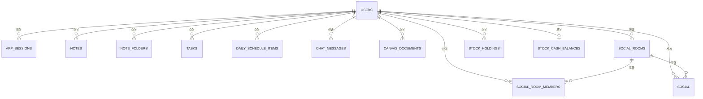

# 데이터베이스 스키마 문서

이 문서는 Flownote 프로젝트에서 사용하는 데이터베이스 스키마에 대한 포괄적인 개요를 제공합니다. 스키마는 주로 `flownote-server` 프로젝트의 Flyway 마이그레이션을 통해 관리되며, `flownote-next`의 Prisma 스키마에도 반영되어 있습니다.

## 데이터베이스 시스템
- **엔진:** PostgreSQL
- **마이그레이션:** Flyway (Java Spring Boot)
- **ORM/클라이언트:** Prisma (Next.js), SQLModel/Pydantic (FastAPI)

---

## 엔티티 관계 개요 (간략화)

---

## 테이블 정의

### 1. `users` (사용자)
핵심 사용자 계정 정보입니다.

| 컬럼명 | 타입 | 제약 조건 | 설명 |
| :--- | :--- | :--- | :--- |
| `id` | UUID | PRIMARY KEY, DEFAULT `gen_random_uuid()` | 고유 사용자 식별자 |
| `username` | TEXT | NOT NULL | 사용자 로그인 아이아이디 |
| `email` | TEXT | NOT NULL, UNIQUE | 사용자 이메일 주소 |
| `password_hash` | TEXT | NOT NULL | 해시된 비밀번호 |
| `nickname` | TEXT | NOT NULL | 화면 표시 이름 |
| `created_at` | TIMESTAMPTZ | NOT NULL, DEFAULT `NOW()` | 계정 생성 일시 |

### 2. `app_sessions` (앱 세션)
사용자 인증 세션 정보입니다.

| 컬럼명 | 타입 | 제약 조건 | 설명 |
| :--- | :--- | :--- | :--- |
| `token` | UUID | PRIMARY KEY | 세션 토큰 |
| `user_id` | UUID | NOT NULL, REFERENCES `users(id)` | 연결된 사용자 |
| `created_at` | TIMESTAMPTZ | NOT NULL, DEFAULT `NOW()` | 세션 시작 일시 |
| `expires_at` | TIMESTAMPTZ | NOT NULL | 세션 만료 일시 |

### 3. `notes` (노트)
마크다운 및 리치 텍스트 노트 정보입니다.

| 컬럼명 | 타입 | 제약 조건 | 설명 |
| :--- | :--- | :--- | :--- |
| `id` | UUID | PRIMARY KEY | 노트 식별자 |
| `user_id` | UUID | NOT NULL, REFERENCES `users(id)` | 노트 소유자 |
| `title` | TEXT | NOT NULL | 노트 제목 |
| `content` | JSONB | NOT NULL, DEFAULT `'[]'` | 리치 텍스트/JSON 콘텐츠 |
| `created_at` | TIMESTAMPTZ | NOT NULL, DEFAULT `NOW()` | 생성 일시 |
| `updated_at` | TIMESTAMPTZ | NOT NULL, DEFAULT `NOW()` | 최종 수정 일시 |

### 4. `note_folders` (노트 폴더)
노트를 카테고리별로 구성하기 위한 폴더 정보입니다.

| 컬럼명 | 타입 | 제약 조건 | 설명 |
| :--- | :--- | :--- | :--- |
| `id` | UUID | PRIMARY KEY, DEFAULT `gen_random_uuid()` | 폴더 식별자 |
| `user_id` | UUID | NOT NULL, REFERENCES `users(id)` | 폴더 소유자 |
| `category` | TEXT | NOT NULL, DEFAULT `''` | 폴더 카테고리 |
| `name` | TEXT | NOT NULL | 폴더 이름 |
| `note_ids` | UUID[] | NOT NULL, DEFAULT `ARRAY[]` | 폴더 내 노트 ID 목록 |
| `created_at` | TIMESTAMPTZ | NOT NULL, DEFAULT `NOW()` | 생성 일시 |
| `updated_at` | TIMESTAMPTZ | NOT NULL, DEFAULT `NOW()` | 최종 수정 일시 |

### 5. `tasks` (할 일)
할 일 관리 및 추적 정보입니다.

| 컬럼명 | 타입 | 제약 조건 | 설명 |
| :--- | :--- | :--- | :--- |
| `id` | TEXT | PRIMARY KEY | 할 일 식별자 (문자열) |
| `user_id` | UUID | NOT NULL, REFERENCES `users(id)` | 할 일 소유자 |
| `task_name` | TEXT | NOT NULL, DEFAULT `''` | 할 일 제목 |
| `category` | TEXT | NOT NULL, DEFAULT `''` | 할 일 카테고리 |
| `difficulty_level` | INTEGER | NOT NULL, DEFAULT 1 | 난이도 (현재 UI 기준 1-3 단계) |
| `status` | TEXT | NOT NULL, DEFAULT `'TODO'` | 할 일 상태 |
| `estimated_minutes`| INTEGER | NOT NULL, DEFAULT 0 | 예상 소요 시간 (분) |
| `actual_minutes` | INTEGER | NOT NULL, DEFAULT 0 | 실제 소요 시간 (분) |
| `due_date` | DATE | NOT NULL, DEFAULT `CURRENT_DATE`| 마감 기한 |
| `memo` | TEXT | NOT NULL, DEFAULT `''` | 추가 메모 |
| `tags` | TEXT[] | NOT NULL, DEFAULT `ARRAY[]`| 태그 목록 |
| `created_at` | TIMESTAMPTZ | NOT NULL, DEFAULT `NOW()` | 생성 일시 |
| `updated_at` | TIMESTAMPTZ | NOT NULL, DEFAULT `NOW()` | 최종 수정 일시 |

### 6. `chat_messages` (채팅 메시지)
간단한 채팅 메시지 이력입니다.

| 컬럼명 | 타입 | 제약 조건 | 설명 |
| :--- | :--- | :--- | :--- |
| `id` | UUID | PRIMARY KEY | 메시지 식별자 |
| `user_id` | UUID | NOT NULL, REFERENCES `users(id)` | 발신자 ID |
| `sender` | TEXT | NOT NULL | 발신자 이름 (레거시) |
| `message` | TEXT | NOT NULL | 메시지 내용 |
| `timestamp` | TIMESTAMPTZ | NOT NULL, DEFAULT `NOW()` | 전송 일시 |

### 7. `canvas_documents` (캔버스 문서)
화이트보드/캔버스 드로잉 데이터입니다.

| 컬럼명 | 타입 | 제약 조건 | 설명 |
| :--- | :--- | :--- | :--- |
| `user_id` | UUID | PRIMARY KEY, REFERENCES `users(id)` | 소유자 (사용자당 하나의 문서) |
| `lines` | JSONB | NOT NULL, DEFAULT `'[]'` | 드로잉 경로 데이터 |
| `images` | JSONB | NOT NULL, DEFAULT `'[]'` | 포함된 이미지 정보 |
| `text_boxes` | JSONB | NOT NULL, DEFAULT `'[]'` | 텍스트 요소 정보 |
| `created_at` | TIMESTAMPTZ | NOT NULL, DEFAULT `NOW()` | 생성 일시 |
| `updated_at` | TIMESTAMPTZ | NOT NULL, DEFAULT `NOW()` | 최종 수정 일시 |

### 8. `social_rooms` (소셜 룸)
소셜 상호작용을 위한 채팅방 정보입니다.

| 컬럼명 | 타입 | 제약 조건 | 설명 |
| :--- | :--- | :--- | :--- |
| `id` | UUID | PRIMARY KEY, DEFAULT `gen_random_uuid()` | 방 식별자 |
| `name` | TEXT | | 방 이름 |
| `created_by` | UUID | NOT NULL, REFERENCES `users(id)` | 방 생성자 |
| `created_at` | TIMESTAMPTZ | NOT NULL, DEFAULT `NOW()` | 생성 일시 |
| `updated_at` | TIMESTAMPTZ | NOT NULL, DEFAULT `NOW()` | 최종 수정 일시 |

### 9. `social_room_members` (소셜 룸 멤버)
방 멤버십을 위한 교차 참조 테이블입니다.

| 컬럼명 | 타입 | 제약 조건 | 설명 |
| :--- | :--- | :--- | :--- |
| `room_id` | UUID | NOT NULL, REFERENCES `social_rooms(id)` | 방 ID |
| `user_id` | UUID | NOT NULL, REFERENCES `users(id)` | 사용자 ID |
| `joined_at` | TIMESTAMPTZ | NOT NULL, DEFAULT `NOW()` | 참여 일시 |

**기본 키:** `(room_id, user_id)`

### 10. `social` (메시지)
소셜 룸 내에서 전송된 메시지입니다.

| 컬럼명 | 타입 | 제약 조건 | 설명 |
| :--- | :--- | :--- | :--- |
| `id` | UUID | PRIMARY KEY, DEFAULT `gen_random_uuid()` | 메시지 식별자 |
| `room_id` | UUID | NOT NULL, REFERENCES `social_rooms(id)` | 대상 방 ID |
| `user_id` | UUID | NOT NULL, REFERENCES `users(id)` | 발신자 ID |
| `message` | TEXT | NOT NULL | 메시지 내용 |
| `timestamp` | TIMESTAMPTZ | NOT NULL, DEFAULT `NOW()` | 전송 일시 |

### 11. `stock_holdings` (주식 보유 현황)
주식 포트폴리오 포지션 정보입니다.

| 컬럼명 | 타입 | 제약 조건 | 설명 |
| :--- | :--- | :--- | :--- |
| `id` | UUID | PRIMARY KEY, DEFAULT `gen_random_uuid()` | 보유 자산 식별자 |
| `user_id` | UUID | NOT NULL, REFERENCES `users(id)` | 소유자 |
| `symbol` | TEXT | NOT NULL | 종목 코드 (티커) |
| `asset_name` | TEXT | NOT NULL | 자산명 (전체 이름) |
| `market` | TEXT | NOT NULL, DEFAULT `''` | 시장 (예: KRX, NASDAQ) |
| `quantity` | NUMERIC(20,6)| NOT NULL, DEFAULT 0 | 보유 수량 |
| `average_price`| NUMERIC(20,4)| NOT NULL, DEFAULT 0 | 평균 매수 단가 |
| `currency` | TEXT | NOT NULL, DEFAULT `'KRW'` | 통화 단위 |
| `sector` | TEXT | NOT NULL, DEFAULT `''` | 산업 섹터 |
| `memo` | TEXT | NOT NULL, DEFAULT `''` | 관련 메모 |
| `created_at` | TIMESTAMPTZ | NOT NULL, DEFAULT `NOW()` | 생성 일시 |
| `updated_at` | TIMESTAMPTZ | NOT NULL, DEFAULT `NOW()` | 최종 수정 일시 |

### 12. `stock_cash_balances` (주식 예수금 잔액)
사용자의 거래 시뮬레이션용 현금 잔액입니다.

| 컬럼명 | 타입 | 제약 조건 | 설명 |
| :--- | :--- | :--- | :--- |
| `user_id` | UUID | PRIMARY KEY, REFERENCES `users(id)` | 소유자 |
| `amount` | NUMERIC(20,4)| NOT NULL, DEFAULT 0 | 현금 잔액 |
| `currency` | TEXT | NOT NULL, DEFAULT `'KRW'` | 통화 단위 |
| `updated_at` | TIMESTAMPTZ | NOT NULL, DEFAULT `NOW()` | 최종 수정 일시 |

### 13. `daily_schedule_items` (반복 시간표)
사용자의 요일별 반복 시간표 항목입니다.

| 컬럼명 | 타입 | 제약 조건 | 설명 |
| :--- | :--- | :--- | :--- |
| `id` | UUID | PRIMARY KEY, DEFAULT `gen_random_uuid()` | 시간표 항목 식별자 |
| `user_id` | UUID | NOT NULL, REFERENCES `users(id)` | 소유자 |
| `title` | TEXT | NOT NULL, DEFAULT `''` | 시간표 제목 |
| `days_of_week` | TEXT[] | NOT NULL, DEFAULT `ARRAY[]` | 반복 요일 (`MON`-`SUN`) |
| `start_time` | TIME | NOT NULL | 시작 시간 |
| `end_time` | TIME | NOT NULL | 종료 시간 |
| `category` | TEXT | NOT NULL, DEFAULT `''` | 분류 |
| `color` | TEXT | NOT NULL, DEFAULT `'#0f766e'` | UI 표시 색상 |
| `memo` | TEXT | NOT NULL, DEFAULT `''` | 메모 |
| `is_active` | BOOLEAN | NOT NULL, DEFAULT `TRUE` | 오늘 시간표 표시 여부 |
| `created_at` | TIMESTAMPTZ | NOT NULL, DEFAULT `NOW()` | 생성 일시 |
| `updated_at` | TIMESTAMPTZ | NOT NULL, DEFAULT `NOW()` | 최종 수정 일시 |

**제약 조건:** `start_time < end_time`

---

## 인덱스 목록

- `idx_notes_user_created`: `notes(user_id, created_at DESC)`
- `idx_tasks_user_due`: `tasks(user_id, due_date ASC)`
- `idx_chat_messages_user_timestamp`: `chat_messages(user_id, timestamp ASC)`
- `idx_social_timestamp`: `social(timestamp ASC)`
- `idx_social_user_timestamp`: `social(user_id, timestamp ASC)`
- `idx_social_room_timestamp`: `social(room_id, timestamp ASC)`
- `idx_social_room_members_user`: `social_room_members(user_id, room_id)`
- `idx_note_folders_user_category`: `note_folders(user_id, category, name)`
- `idx_stock_holdings_user_symbol`: `stock_holdings(user_id, symbol)`
- `idx_stock_holdings_user_created`: `stock_holdings(user_id, created_at DESC)`
- `idx_daily_schedule_items_user_time`: `daily_schedule_items(user_id, start_time ASC)`
- `idx_daily_schedule_items_user_active`: `daily_schedule_items(user_id, is_active)`
